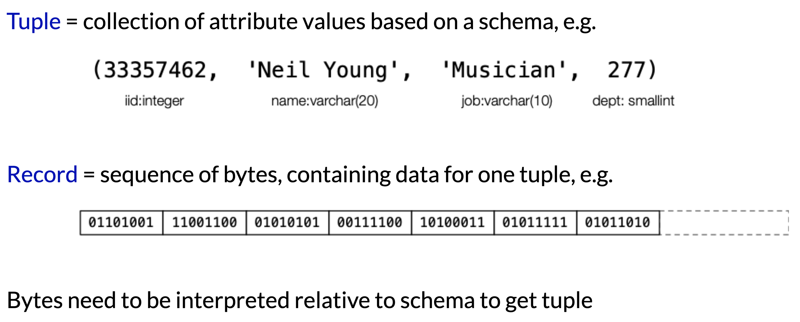
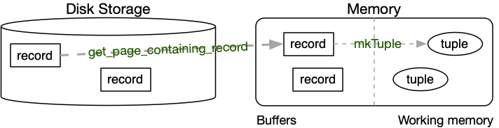
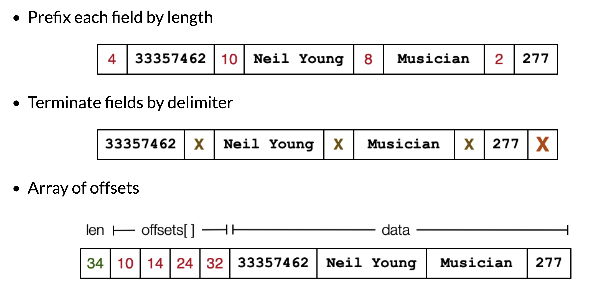
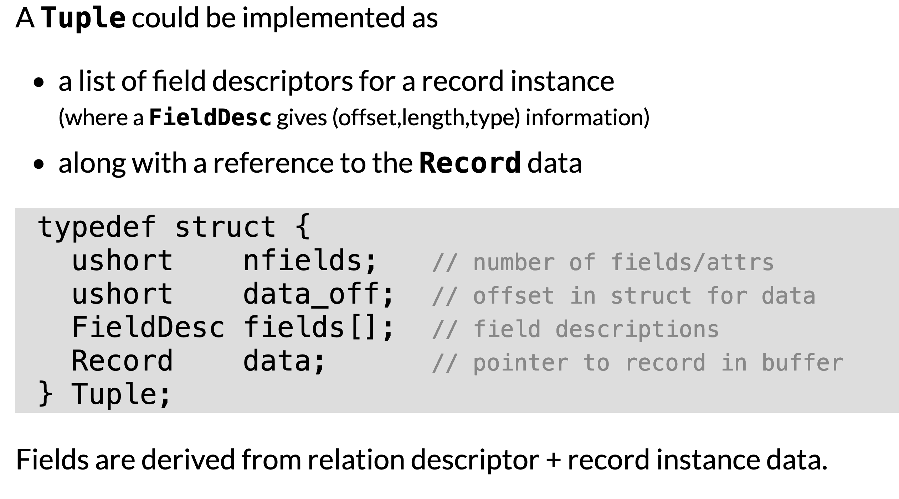
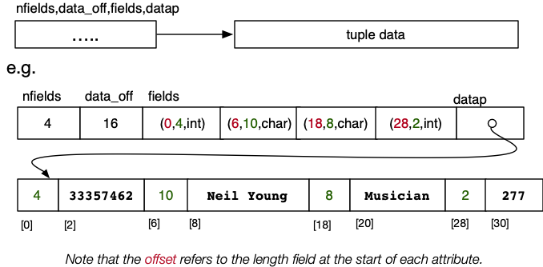
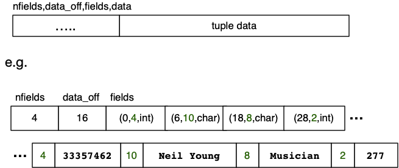

# Tuple 的表示

# Tuple Vs Record

  

所以数据库想要实现tuple的访问，需要经历

    Record -> Inteprete as tuple -> access by tuple

## 互相的转化
 A Record is an array of bytes (byte[])

    representing the data values from a typed Tuple
    stored on disk (persistent) or in a memory buffer 

A Tuple is a collection of named,typed values  (cf. C struct)

    to manipulate the values, need an "interpretable" structure
    stored in working memory, and temporary 



具体步骤

1. retrive record

通过表的id和record的id取得record
``` c
Record get_record(Relation rel, RecordId rid) {
    (pid,tid) = rid;
    Page buf = get_page(rel, pid);
    return get_bytes(rel, buf, tid);
}
```
2. 将record转化为tuple

``` c
Relation rel = ... // relation schema
Record rec = get_record(rel, rid)
Tuple t = mkTuple(rel, rec)
```
table的schema数据可以帮我们搞清楚table的数据类型有什么

record中特殊的结构可以帮助我们搞清楚variable-length record中properties是怎么安放的

Record不同的结构:


  


3. tuple的表示

      


1. 由tuple的 field descriptor关联到具体的数据

    两种方式M

    在field descriptor中使用pointer指向最终的数据

      

    直接把数据append到field descriptor的后面

      


