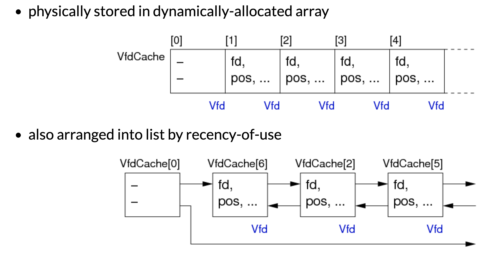
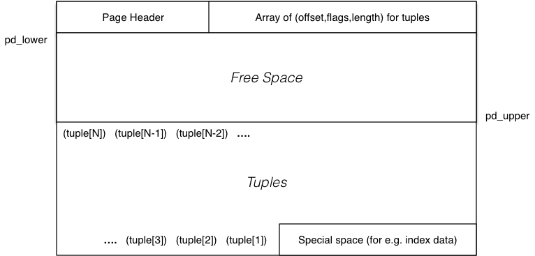

# 数据库中一些文件大小的事例（主要有一个感觉）

  

# 不同数据库对于文件的管理方式

首先我们要熟悉几个基础的文件操作方式：

``` c
fd = open(fileName,mode)
  // open a named file for reading/writing/appending
close(fd)
  // close an open file, via its descriptor 
nread = read(fd, buf, nbytes)
  // attempt to read data from file into buffer 
nwritten = write(fd, buf, nbytes)
  // attempt to write data from buffer to file
lseek(fd, offset, seek_type)
  // move file pointer to relative/absolute file offset
fsync(fd)
  // flush contents of file buffers to disk
```


## 文件管理方式

* by-pass the file system and use a raw disk partition
* have a single very large file containing all DB data
* have several large files, with tables spread across them
* have multiple data files, one for each table
* have multiple files for each table 

思考：相比于单一文件的数据库管理方式，多文件只是将磁盘管理的过程扔给了操作系统（操作系统实现磁盘管理，从而实现单文件的自由增减大小）

# PGSQL的文件管理方式

## Relations as Files

对于database中的每一个relation（table），都需要将其map到特定的文件当中:

``` c
typedef struct RelFileNode {
    Oid  spcNode;  // tablespace
    Oid  dbNode;   // database
    Oid  relNode;  // relation
} RelFileNode;
```

我们可以使用这些信息获得filepath：

``` c
char *relpath(RelFileNode r)  // simplified
{
   char *path = malloc(ENOUGH_SPACE);

   if (r.spcNode == GLOBALTABLESPACE_OID) {
      /* Shared system relations live in PGDATA/global */
      Assert(r.dbNode == 0);
      sprintf(path, "%s/global/%u",
              DataDir, r.relNode);
   }
   else if (r.spcNode == DEFAULTTABLESPACE_OID) {
      /* The default tablespace is PGDATA/base */
      sprintf(path, "%s/base/%u/%u",
              DataDir, r.dbNode, r.relNode);
   }
   else {
      /* All other tablespaces accessed via symlinks */
      sprintf(path, "%s/pg_tblspc/%u/%u/%u", DataDir
              r.spcNode, r.dbNode, r.relNode);
   }
   return path;
}
```

但是在现实中，一个table不会只对应一个文件（Unix系统的文件大小限制为1Gb)，我们需要一个文件管理者，能够使用特定的RelFileNode和pageId来访问特定的block

## PageId
pageId的结构如下，定义了对于一个特定的文件，如何访问特定的位置
``` c
typedef struct
{
    RelFileNode rnode;    // which relation/file
    ForkNumber  forkNum;  // which fork (of reln)
    BlockNumber blockNum; // which page/block 
} BufferTag;
```
使用file manager访问的大致过程
``` c
// pageID set from pg_catalog tables
// buffer obtained from Buffer pool
getBlock(BufferTag pageID, Buffer buf)
{
   Vfd vf;  off_t offset;
   (vf, offset) = findBlock(pageID)
   lseek(vf.fd, offset, SEEK_SET)
   vf.seekPos = offset;
   nread = read(vf.fd, buf, BLOCKSIZE)
   if (nread < BLOCKSIZE) ... we have a problem
}
```
File Descriptor Pool: 文件描述符池

Unix has limits on the number of concurrently open files.


## Filemanager

PostgreSQL maintains a pool of open file descriptors:

    to hide this limitation from higher level functions
    to minimise expensive open() operations 

需要实现这么一个池子，我们就需要一个虚拟文件描述符，这个虚拟文件描述符的结构如下：

``` c
typedef struct vfd
{
    s_short  fd;              // current FD, or VFD_CLOSED if none
    u_short  fdstate;         // bitflags for VFD's state
    File     nextFree;        // link to next free VFD, if in freelist
    File     lruMoreRecently; // doubly linked recency-of-use list
    File     lruLessRecently;
    long     seekPos;         // current logical file position
    char     *fileName;       // name of file, or NULL for unused VFD
    // NB: fileName is malloc'd, and must be free'd when closing the VFD
    int      fileFlags;       // open(2) flags for (re)opening the file
    int      fileMode;        // mode to pass to open(2)
} Vfd;
```

池子的结构：

  

# Buffer pool 缓存池 

[课件](keynotes/Buffer%20Pool.html)

由于数据库的读写操作有很多，这种操作非常的昂贵，所以我们需要设计一个缓冲池

  

缓存池分为两个array：

  

一个array用来存放真正的缓存frame，另外一个array用来存放每一个frame的信息

对于一个frame，我们想知道：

* which Page it contains, or whether empty/free
* whether it has been modified since loading (dirty bit)
* how many transactions are currently using it (pin count)
* time-stamp for most recent access (assists with replacement) 

缓存的效率如何计算呢？


*Cost benefit from buffer pool (with n frames) is determined by:*

* number of available frames (more ⇒ better)
* replacement strategy vs page access pattern 

这两句话很重要，第一句话很好理解，buffer越大越好。

第二句话可以refer这节课ppt的最后一个例子加强理解


# Pgsql使用的buffer manager

[课件](../Notes/keynotes/PostgreSQL%20Buffer%20Manager.html)

## 特点

	

PostgreSQL buffer manager:

    provides a shared pool of memory buffers for all backends
    all access methods get data from disk via buffer manager 

源代码中的位置

Definitions:  src/include/storage/buf*.h

Functions:  src/backend/storage/buffer/*.c 

## 组成

 BufferDescriptors

    shared fixed array (size NBuffers) of BufferDesc 

BufferBlocks

    shared fixed array (size NBuffers) of 8KB frames 

Buffer = index values in above arrays

    indexes: global buffers 1..NBuffers; local buffers negative 

## Clock-sweep Replacement Strategy

  

例子：
  

# page储存管理（page Internals）

由于tuple有可能是固定大小的也有可能是大小变化的，所以我们在page中需要管理tuple的分布。

具体可以参考[课件](keynotes/Page%20Internals.html)

# Postgresql page内存管理

[课件](keynotes/PostgreSQL%20Page%20Internals.html)


## Page组成

Each page is 8KB (default BLCKSZ) and contains:

* header (free space pointers, flags, xact data)
* array of (offset,length) pairs for tuples in page
* free space region (between array and tuple data)
* actual tuples themselves (inserted from end towards start)
* (optionally) region for special data (e.g. index data) 
  
大文件: Large data items are stored in separate (TOAST) files   (implicit)

图片示例：
  
